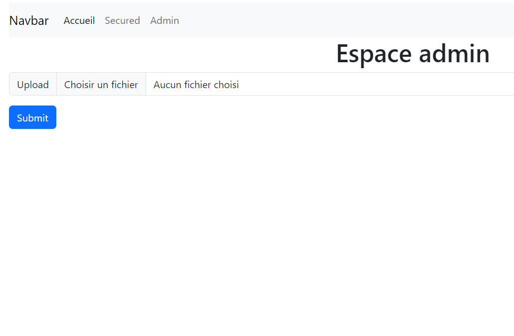

# Projet de deux médecins : échange de fichiers médicaux sécurisé  

## application :   

L'application web java (Spring boot) permet à un.e utilisateur.trice enregistré.e administrateur.trice d'uploader un fichier, et à un.e médecin utilisateur.trice de le télécharger.  

Les fichiers sont automatiquement supprimés du serveur après téléchargement, et systématiquement après un jour sur le serveur.  

La connection admin permet d'uploader des fichiers .odt ou .doc, l'option est paramétrable dans le fichier Enum file.Extensions.  

La connection utilisateur.trice se déroule en deux temps. Un premier formulaire permet de vérifier que le courriel est bien enregistré. Un mot de passe est alors généré et envoyé par mail. La disponiblité de la connection est alors fixée à 5 minutes dans Redis.  

## installation : 

Le dossier download, le fichier admin.txt, le fichier mail.txt, le fichier downloader.txt sont à créer au même niveau que le .jar.  

Les admins, ux, identifiants gmail sont stockés en dur :   

Le fichier admin.txt doit se présenter sous cette forme :   
email=monemail@f.com  
password=YYYY-MM-DD  
Il est possible de spécifier plusieurs administrateurs - et autant de mots de passe - en les séparant par des virgules, sans espace.  

Le fichier mail.txt est prévu pour utiliser gmail, un seul utilisateur : 
email=monemail@gmail.com  
password=mot_de_passe_d'application_tierce_partie  

Le fichier downloader :  
email=email1@f.com,(email2@d.fr ...etc)     

Pour installer le .jar et la base de données Redis : 
``` 
docker-compose up --build
```

Pour utilisation en local, supprimer le service serveur-med dans le docker-compose, ajouter une ouverture de port dans le service Redis (port 6379 en extérieur et intérieur) et changer la connection dans redis.Connect de serveur-med par localhost.

  

## technologies : 

- java  
- Spring Boot  
- Redis  
- Thymleaf / Bootstrap
- Docker  
- maven


